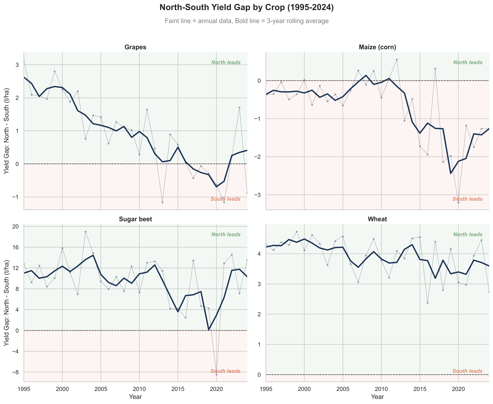

# Land-Use Efficiency and Crop Yield Trends in the European Union

A data-driven assessment of agricultural sustainability in the EU using FAOSTAT data (1995-2024).



## Motivation

Sustainable biomass production is essential for the EU Green Deal and the European Bioeconomy Strategy. This project investigates how crop yields and land use have evolved across six major EU agricultural producers (Germany, France, Italy, Spain, Portugal, and the Netherlands) over three decades. The analysis aims to identify which countries have achieved productivity gains without expanding their agricultural land, and whether the historical yield gap between Northern and Southern producers has narrowed over time.

## Research Questions

1. How have crop yields evolved in the EU over the last 30 years?
2. Which EU countries achieve higher yields without expanding agricultural land?
3. Are Southern EU countries converging or diverging from Northern EU yield levels?

## Key Findings

- **Convergence in grapes and maize:** The Southern producers have closed the yield gap with the North. In maize, Spain has overtaken the Northern average since around 2015.
- **Persistent divergence in sugar beet and wheat:** The Northern yields remain considerably higher, and the gap is structural rather than narrowing.
- **Efficiency winners:** Germany and Spain achieved significantly higher sugar beet yields while reducing the harvested area. Italy demonstrated similar gains across multiple crops.

## Methods

- Data cleaning and interpolation of missing values within each country-crop-element group.
- Weighted regional yield computed as the sum of production divided by the sum of area harvested. This approach ensures that larger producers contribute proportionally to the regional figure.
- Three-year averages and rolling means to separate structural trends from year-to-year noise.
- Visualisation with Seaborn (`relplot`, faceted scatter and line charts).

## Tools

Python, pandas, Seaborn, Matplotlib, NumPy, Jupyter.

## How to Reproduce

```bash
git clone https://github.com/yourusername/eu-crop-yield-analysis.git
cd eu-crop-yield-analysis
pip install -r requirements.txt
jupyter lab
```

Then run the notebooks in order (01 to 04).

## Project Structure


